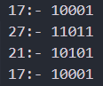
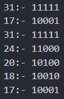
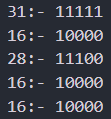
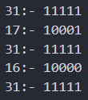
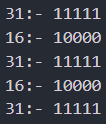
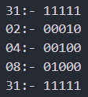
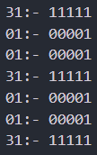

Numbers_set_1:- ```17 27 21 17```

Numbers_set_2:- ```31 17 31 24 20 18 17```

Numbers_set_3:- ```31 16 28 16 16```

Numbers_set_4:- ```31 17 31 16 31```

Numbers_set_5:- ```31 16 31 16 31```

Numbers_set_6:- ```31 2 4 8 31```

Numbers_set_7:- ```31 1 1 31 1 1 31```


[Decimal to Binary](https://www.rapidtables.com/convert/number/decimal-to-binary.html)


Binary of set 1 is:    
 


Binary of set 2 is:    
 


Binary of set 3 is:




Binary of set 4 is:    
 


Binary of set 5 is:    
 


Binary of set 6 is:    
 


Binary of set 7 is:    
 


Now Considering only the 1's and ignoring all the 0's we can see each set of binary creates a word which is the flag

FLAG:- **KJSCE_CTF{MRFeEZ3}**
