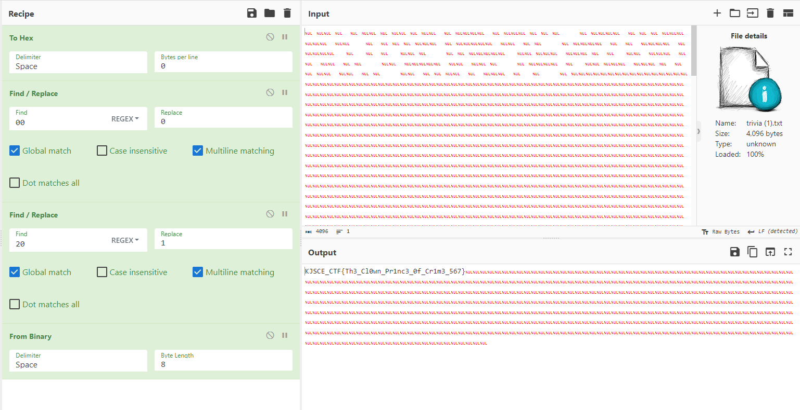

# where-are-the-bits

**Description**: Ah, detective, you're in need of a hint!

**File**: [trivia.txt](./files/trivia.txt)

## Solution

Breaking down the hex of the file and replacing `00` with `0` and `20` with `1`.

<figure></figure>

## Flag
```
KJSCE_CTF{Th3_Cl0wn_Pr1nc3_0f_Cr1m3_567}
```