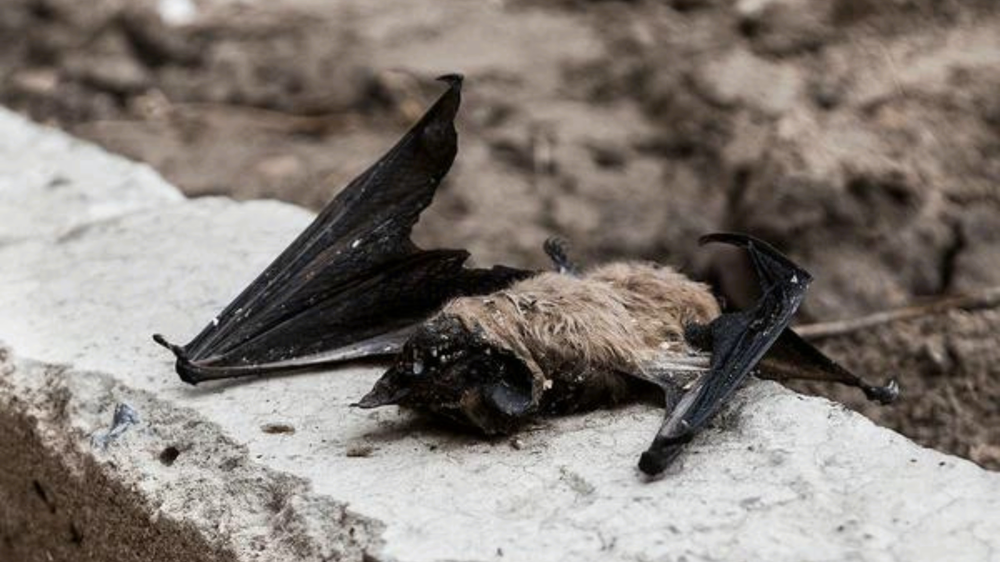
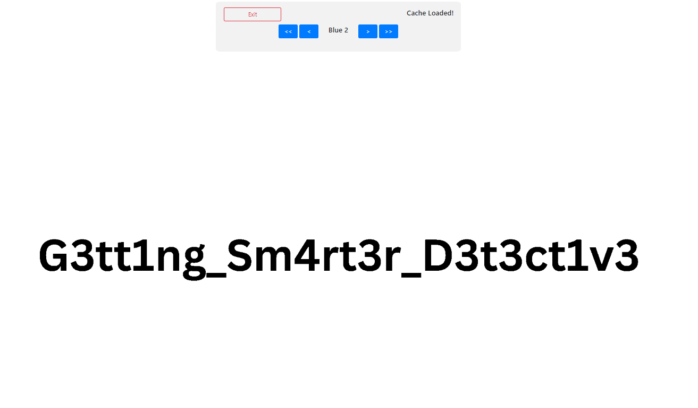

# Dead Bat

**Description**: Riddle me this, Batman! What's hidden in plain sight?

**File**: [Deadbat.png](./files/DeadBat.png)

## Solution

We are given an image.

<figure></figure>

Upload this file to [georgeom.net/StegOnline](https://georgeom.net/StegOnline/upload) and browse the bit planes.

We get the flag on `Blue 2`.

<figure></figure>

## Flag
```
KJSCE_CTF{G3tt1ng_Sm4rt3r_D3t3ct1v3}
```