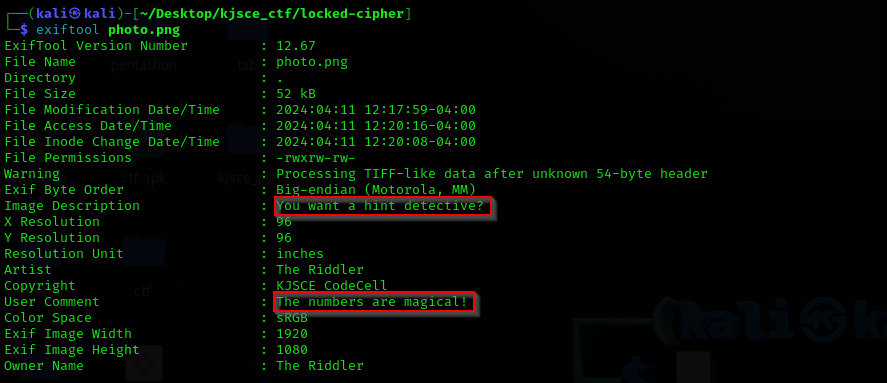
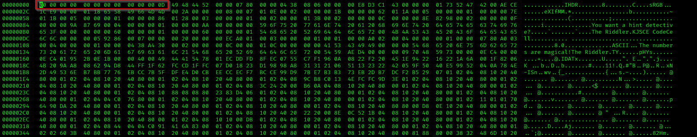
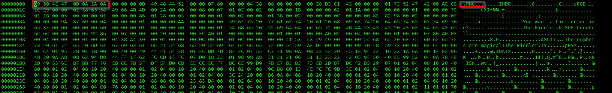
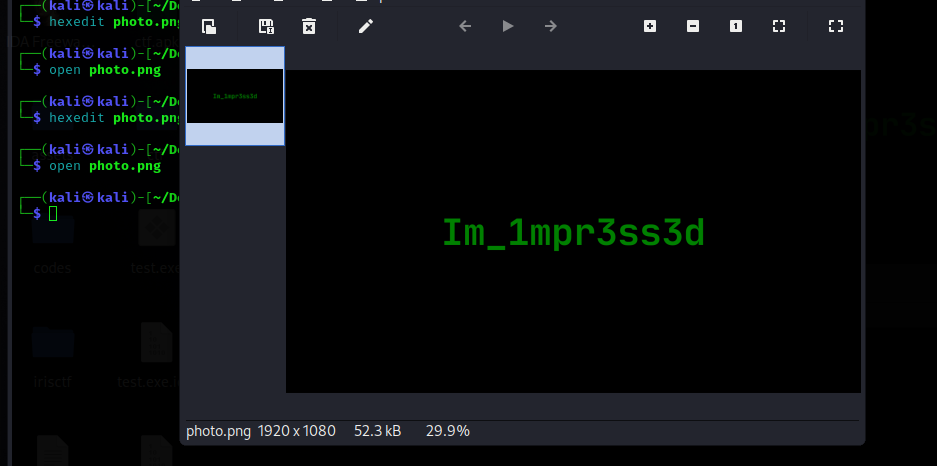

# Locked Cipher

**Description**: Unravel the flag concealed in this image, or let the riddle persist.

**File**: [photo.png](./files/photo.png)

## Solution

We are given a png file but it doesn't seem to open. Let's analyze it.

Looking at the `exif` data of the file. It says `The numbers are magical`.

<figure></figure>

On analyzing the hex of the file, we can see that some bits are missing.

<figure></figure>

On correcting the bits of the hex using the standard header of a png file, `89 50 4E 47 0D 0A 1A 0A`.

<figure></figure>

We are now able to opent the file.

<figure></figure>

## Flag
```
KJSCE_CTF{Im_1mpr3ss3d}
```