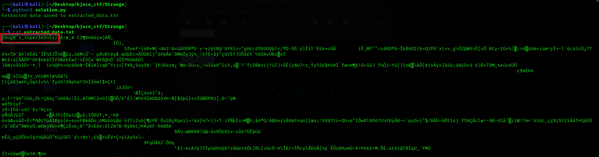

# Strange

**Description**: Riddle me this!

EHT AMGINE FO RUOY DNIM SETANICSAF ,EM ,EGNARTS TUB NAC UOY REHPICED EHT ELZZUP FO RUOY NWO ECNETSIXE

**File**: [strange.wav](./files/Strange.wav)

## Solution

We wrote a code to find the `Least Significat Bit` of the wave file.

<figure></figure>

## Flag
```
KJSCE_CTF{Hug0's_3xper1m3nts}
```