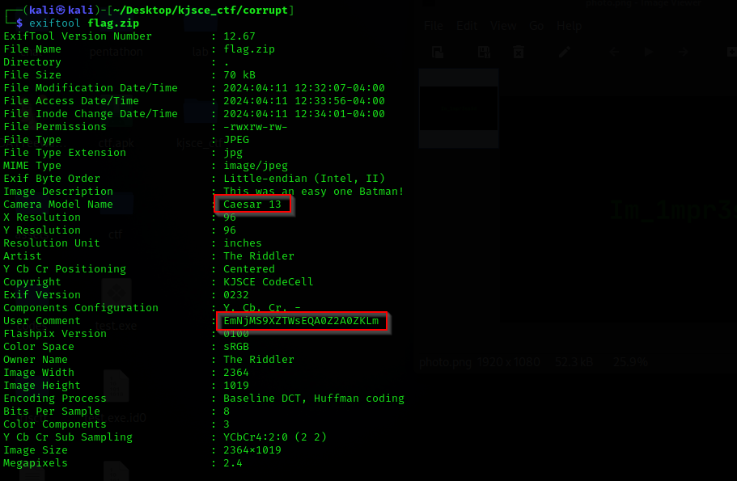
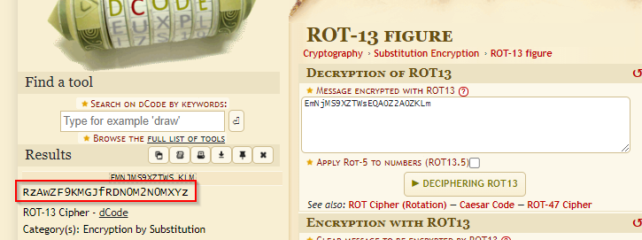
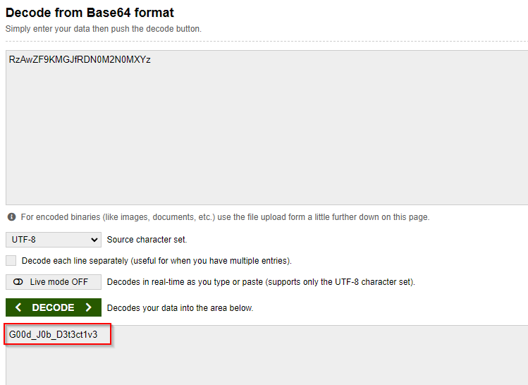

# The corrupt

**Description**: Your detective skills are needed to discern the correct file type, unravel the layers, and expose the hidden message within.

**File**: [flag.zip](./files/flag.zip)

## Solution

Looking at the exif data of the zip file.

<figure></figure>

It says `Ceaser 13` so let's convert the `User Comment`.

<figure></figure>

Now use Base64 decode to convert this string.

<figure></figure>

## Flag
```
KJSCE_CTF{G00d_J0b_D3t3ct1v3}
```