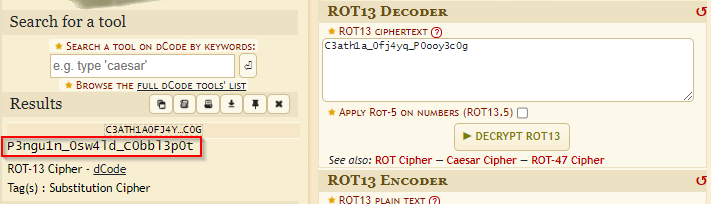

# QR isn't QRing

**Description**: Oh Batman! it seems our puzzle teases us, refusing to unveil its secrets.

**Files**: [QR.png](./files/QR.png)

## Solution

The given file is a wierd QR code which looks like this.

<figure></figure>

This type of QR code is called rMQR.

Let's scan this with an app that supports rMQR. I used `Scandit Demo` available on Play Store to scan this.

<figure></figure>

```
C3ath1a_0fj4yq_P0ooy3c0g
```

Decrypting this text using `ROT13`, we get the flag.

<figure></figure>

## Flag
```
KJSCE_CTF{P3ngu1n_0sw4ld_C0bbl3p0t}
```