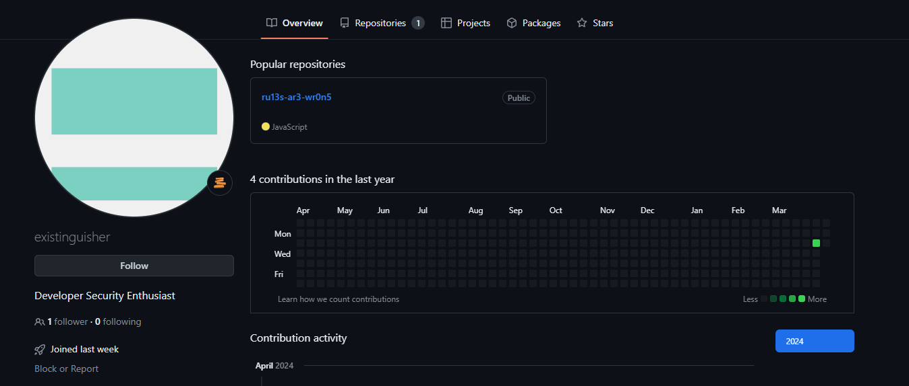
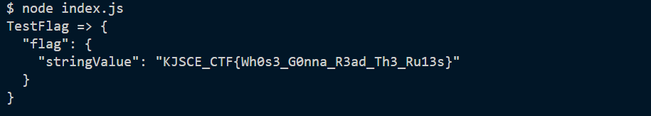

# Rulebreaker 

**Description**: In the shadows of cyberspace, 'Existinguisher' lurks—a nerdy developer, weaving threads of intrigue. But fear not, for even in the byte-sized clues, the essence of his digital fingerprint awaits our decryption.

## Solution

The description focuses on 'Existinguisher' and says they're a nerdy developer. Maybe it could be a username.

Searching on instagram, we get

<figure></figure>

It just says he's a `firebase developer`.

On going to this username's GitHub.

<figure></figure>

This repo has some `firebase` related code which matches his Instagram bio. This means we are on the right track.

On Running the code in the repo, we get the flag.

<figure></figure>

## Flag
```
KJSCE_CTF{Wh0s3_G0nna_R3ad_Th3_Ru13s}
```