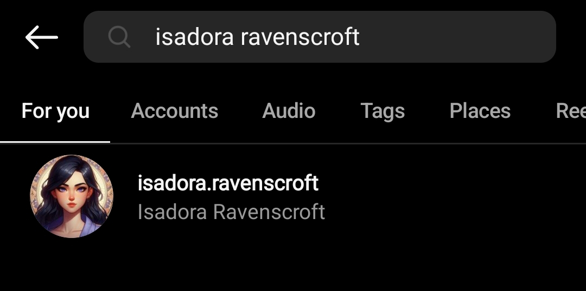
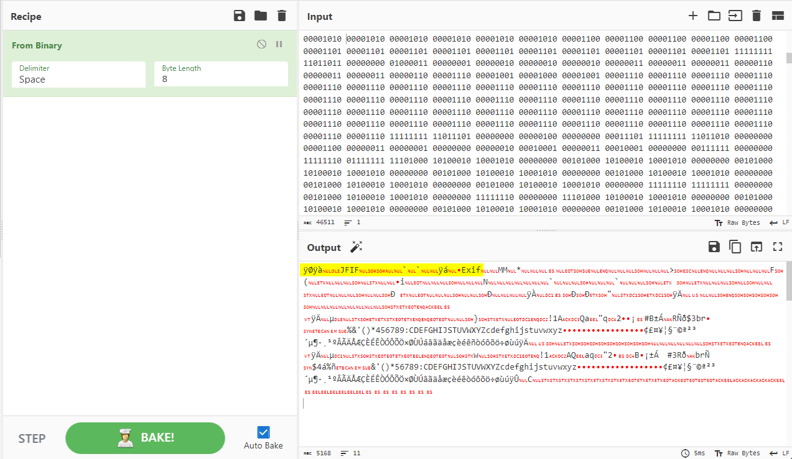
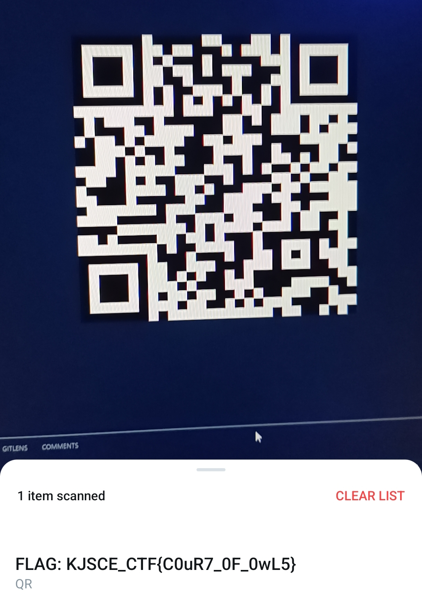

# The court 

**Description**: Ah, Batman, my caped crusading adversary!

Do you relish the enigma that is ***Isadora Ravenscroft***? She's not just another **fashionable** facade in Gotham's glittering skyline, but rather a **puzzle piece** in a grander scheme, one that even your formidable intellect might struggle to unravel!

## Solution

Isadora Ravenscroft again sounds like a username. Let's search it up on Instagram.

<figure></figure>

After scanning through the whole profile, in one of the highlights I found a pastebin link.

<figure></figure>

```
http://pastebin.com/jgsvd5Ae
```

We download the file [file.txt](./files/flag.txt.txt)

The text is in binary so we convert the whole thing to text from `cyberchef`.

<figure></figure>

We can see that this shows a JFIF file signature which is a JPG file when we download it.

<figure></figure>

On scanning this QR Code, we get the flag.

<figure></figure>

## Flag
```
KJSCE_CTF{C0uR7_0F_0wL5}
```