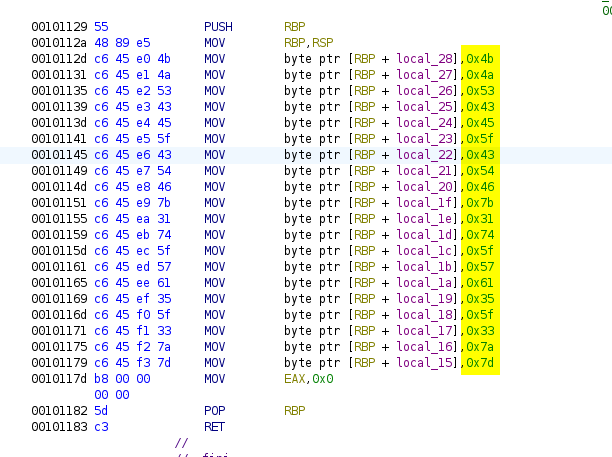
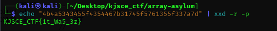
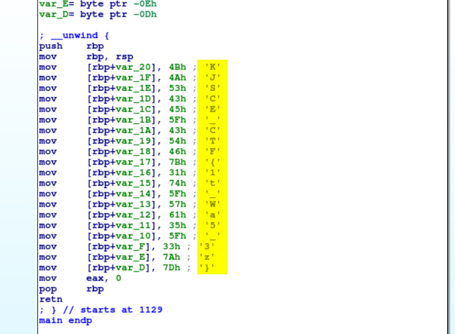

# Array Asylum

**Description**:I pose this riddle to you, Batman? Can you navigate the tangled arrays of madness and unlock the secrets hidden within?

**File**: [rev2](./files/rev2)

## Solution

**Through Ghidra**:

We could see some hex strings while analyzing the main function.

<figure></figure>

Converting the hex to text, we get the flag.

<figure></figure>

**Through IDA**:

Importing the file into IDA will give the flag at startup itself.

<figure></figure>

## Flag
```
KJSCE_CTF{1t_Wa5_3z}
```