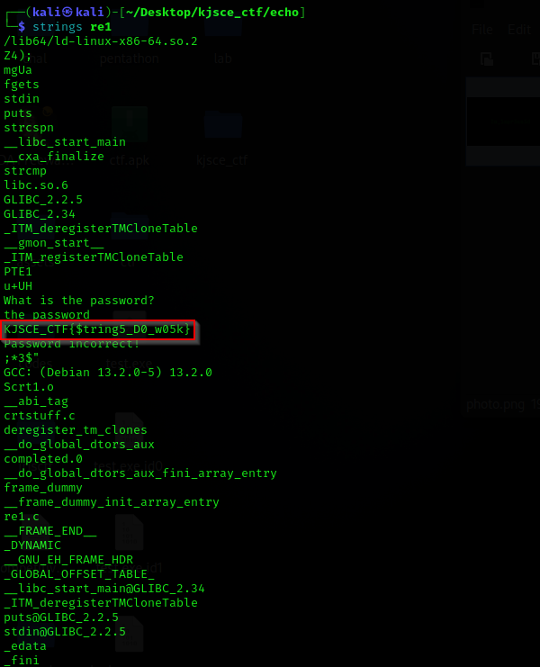

# Echo

**Description**: Ah, the enigma of it all, Batsy! Unravel the secrets embedded in the echoes!

**File**: [re1](./files/re1)

## Solution

The flag could be found on reading the `strings` of the binary file.

<figure></figure>

## Flag
```
KJSCE_CTF{$tring5_D0_w05k}
```