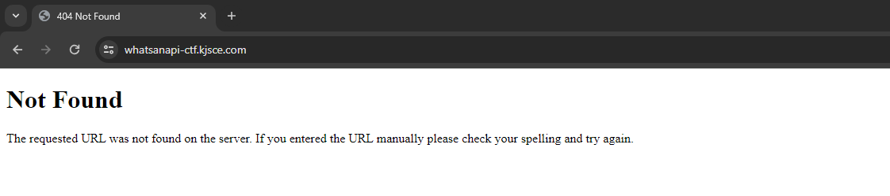
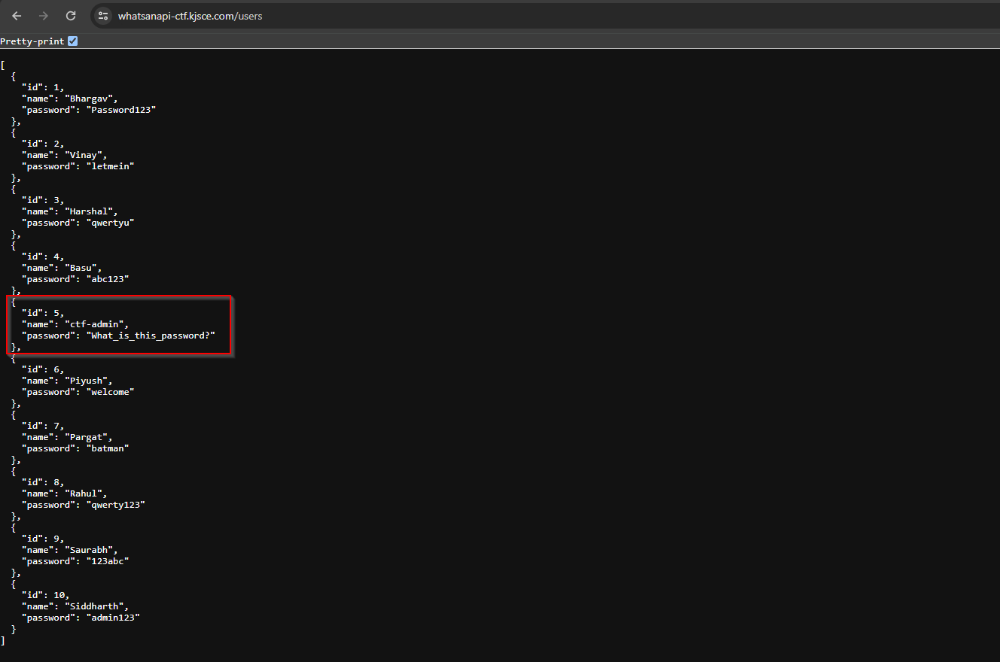
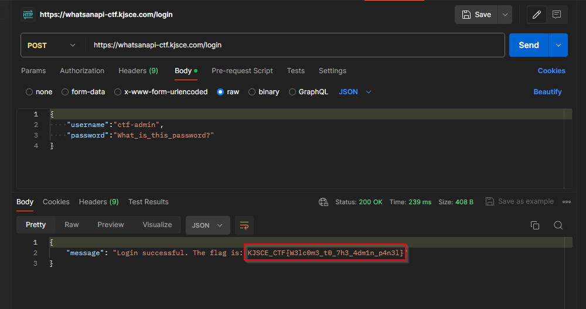

# WatsanAPI

**Description**: Riddle me this, Detective! Decode the mystery and unveil the hidden secret within the /users and /login endpoints. Can you navigate the digital maze?

**Link**: [whatsanapi-ctf.kjsce.com](https://whatsanapi-ctf.kjsce.com)

## Solution

On opening up the link, we get a 404 Not Found, But this endpoint had no functionality or page to it.

<figure></figure>

In the description we can see that 2 endpoints are already mentioned `/users` and `/login`. 

On `/users` we could see a bunch of login credentials, but this was the one that stood out the most.

<figure></figure>

Now, let's open up `Postman` since we need to make a POST request to the `/login` endpoint.

<figure></figure>

## Flag
```
KJSCE_CTF{W3lc0m3_t0_7h3_4dm1n_p4n3l}
```